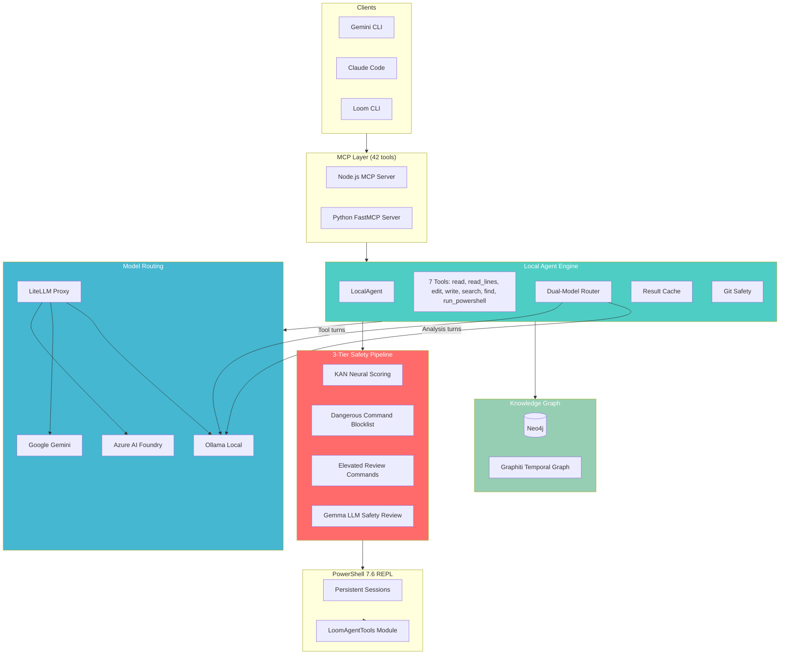

<div align="center">

```
  _
 | |    ___   ___  _ __ ___
 | |   / _ \ / _ \| '_ ` _ \
 | |__| (_) | (_) | | | | | |
 |_____\___/ \___/|_| |_| |_|
```

### Multi-Agent Orchestration Platform

**Local-first AI agents with tool-calling, 3-tier safety, and knowledge graph memory**

[](https://github.com/Nickalus12/Loom/releases)
[](tests/)
[](LICENSE)
[](https://python.org)

[](https://github.com/google-gemini/gemini-cli)
[](https://docs.anthropic.com/en/docs/claude-code)
[](https://ollama.com)
[](https://ai.azure.com)
[](https://neo4j.com)
[](https://github.com/BerriAI/litellm)

---

`22 Agents` | `42 MCP Tools` | `398 Tests` | `3 Safety Tiers` | `13 Commands` | `7 Agent Tools`

</div>

---

## What is Loom?

Loom is a multi-agent orchestration platform that runs **local AI agents** with real tool-calling ability. Your Ollama models can read files, edit code, search your codebase, run PowerShell commands, create git branches, and remember context across sessions — all through a 3-tier safety pipeline that prevents dangerous operations.

It works as a plugin for both **Gemini CLI** and **Claude Code**, or standalone via its own CLI.

### What makes it different

| Feature | Loom | LangChain | CrewAI | AutoGen |
|---------|------|-----------|--------|---------|
| **Local-first agents** | Ollama models with real tool-calling | Cloud API wrappers | Cloud API wrappers | Cloud API wrappers |
| **Safety pipeline** | KAN neural scoring + blocklist + Gemma LLM review | None built-in | None built-in | None built-in |
| **Dual-platform plugin** | Gemini CLI + Claude Code native | Python SDK only | Python SDK only | Python SDK only |
| **PowerShell MCP tools** | 42 tools (file, git, build, test, system) | Requires custom tools | Requires custom tools | Requires custom tools |
| **Knowledge graph memory** | Neo4j/Graphiti temporal graph | Vector store only | Vector store only | Vector store only |
| **Git safety** | Auto-branch before writes, auto-diff | Manual | Manual | Manual |
| **3-tier model routing** | Azure (heavy) / Gemini (light) / Ollama (local) | Single provider | Single provider | Single provider |

---

## Quick Start

### 30-Second Setup

```bash
# 1. Install
pip install -e .

# 2. Pull a model (if using local agents)
ollama pull qwen3:4b

# 3. Run your first agent task
loom agent "Review src/loom/server.py for security issues"
```

### Full Setup (all features)

```bash
# Clone
git clone https://github.com/Nickalus12/Loom.git
cd Loom

# Install with dependencies
pip install -e ".[test]"

# Start services (Neo4j for memory, LiteLLM for cloud routing, Ollama for local)
docker-compose up -d

# Pull local models
ollama pull qwen3:4b              # Fast tool-calling
ollama pull deepseek-coder-v2:16b # Smart analysis
ollama pull gemma4:e2b             # Safety review

# Configure
cp .env.example .env
# Edit .env with your API keys

# Verify
loom status
```

### Plugin Installation

**Gemini CLI:**
```bash
gemini extensions install https://github.com/Nickalus12/Loom
```

**Claude Code:**
```bash
claude plugin install /path/to/Loom/claude
```

---

## Commands

| Command | What It Does |
|---------|-------------|
| `loom agent "task"` | Run a local Ollama agent with tool-calling |
| `loom craft "task"` | Multi-agent pipeline (architect + audit + code + review) |
| `loom safety "cmd"` | Score a PowerShell command's risk level |
| `loom status` | System health check (Ollama, PowerShell, Neo4j, KAN) |
| `loom tools` | List all 42 MCP tools |
| `loom test` | Run the test suite |

### Plugin Commands (Gemini CLI / Claude Code)

| Command | Purpose |
|---------|---------|
| `/loom:craft` | Multi-agent pipeline with cloud or local execution |
| `/loom:agent` | Local Ollama agent task |
| `/loom:review` | Code review on staged changes or paths |
| `/loom:debug` | Root cause investigation |
| `/loom:execute` | Execute an approved plan |
| `/loom:resume` | Resume interrupted session |
| `/loom:status` | Show session status |
| `/loom:archive` | Archive completed session |
| `/loom:security-audit` | Security vulnerability assessment |
| `/loom:perf-check` | Performance analysis |
| `/loom:seo-audit` | SEO assessment |
| `/loom:a11y-audit` | Accessibility compliance |
| `/loom:compliance-check` | Regulatory compliance review |

---

## Architecture



---

## The Local Agent

The heart of Loom V5. Your Ollama models become autonomous agents that can actually do work:

```python
# What the agent can do in a single task:
1. Read files with line numbers          # read_file, read_file_lines
2. Edit specific lines (search/replace)  # edit_file
3. Write new files                       # write_file
4. Search code with regex                # search_code
5. Find files by pattern                 # find_files
6. Run any PowerShell command            # run_powershell (through safety pipeline)
7. Create git branches automatically     # before first write
8. Validate Python syntax after writes   # automatic ast.parse check
9. Cache file reads within a task        # no duplicate reads
10. Remember context across sessions     # Graphiti knowledge graph
```

### Dual-Model Routing

The agent uses two models for efficiency:

| Phase | Model | Why |
|-------|-------|-----|
| Tool-calling turns | `qwen3:4b` (fast) | Quick file reads, searches, edits |
| Final analysis | `deepseek-coder-v2:16b` (smart) | High-quality synthesis and reasoning |

The switch happens automatically — tool turns use the fast model, the final response uses the smart model.

---

## Safety Pipeline

Every PowerShell command passes through three layers before execution:

```
Command → KAN Neural Scoring → Blocklist Check → Gemma LLM Review → Execute
              (instant)           (instant)         (intelligent)
```

| Tier | What Happens | Example |
|------|-------------|---------|
| **Hard Block** | Always denied, no review | `Format-Volume`, `rm -rf`, `Stop-Computer` |
| **Elevated Review** | Forces Gemma LLM review, blocked if unavailable | `Invoke-WebRequest`, `Start-Process`, `Set-ItemProperty` |
| **Safe** | KAN scores, skips Gemma if low-risk | `Get-ChildItem`, `Write-Host`, `Read-LoomFile` |

The KAN engine extracts 16 features from each command (network ops, registry access, deletion patterns, etc.) and scores risk in <1ms. If the score is ambiguous, the command is escalated to Gemma for intelligent review.

---

## Model Routing

Loom routes to the best model for each task through LiteLLM:

| Tier | Primary | Fallback | Use Case |
|------|---------|----------|----------|
| **Heavy** | Azure AI Foundry | Google Gemini | Complex reasoning, architecture |
| **Light** | Google Gemini | Ollama qwen3 | Utility tasks, docs, audits |
| **Local** | Ollama (multiple) | - | On-device inference, no API calls |

```yaml
# litellm_config.yaml — just change the model names to use any provider
model_list:
  - model_name: "heavy/default"
    litellm_params:
      model: "azure/your-deployment"     # Or gemini/, openai/, anthropic/
      api_key: "os.environ/YOUR_KEY"
```

Agents specify their tier in frontmatter. The orchestrator routes automatically:

```yaml
# agents/architect.md
---
name: architect
tier: heavy          # Routes to Azure/Gemini
temperature: 0.3
---
```

---

<details>
<summary><h2>The 22 Agents</h2></summary>

| Agent | Tier | Focus |
|-------|------|-------|
| `architect` | Heavy | System design, technology selection |
| `coder` | Heavy | Feature implementation, SOLID principles |
| `debugger` | Heavy | Root cause analysis, execution tracing |
| `refactor` | Heavy | Code restructuring, technical debt |
| `security_engineer` | Heavy | Vulnerability assessment, OWASP |
| `api_designer` | Heavy | REST/GraphQL contracts, versioning |
| `code_reviewer` | Light | Code quality, bug detection |
| `tester` | Light | Unit/integration/E2E tests, TDD |
| `technical_writer` | Light | API docs, READMEs, ADRs |
| `devops_engineer` | Light | CI/CD, Docker, Terraform |
| `performance_engineer` | Light | Profiling, bottleneck identification |
| `data_engineer` | Light | Schema design, query optimization |
| `ux_designer` | Light | User flows, wireframes, usability |
| `product_manager` | Light | PRDs, user stories, prioritization |
| `seo_specialist` | Light | Technical SEO, schema markup |
| `accessibility_specialist` | Light | WCAG compliance, ARIA review |
| `compliance_reviewer` | Light | GDPR/CCPA, licensing |
| `i18n_specialist` | Light | Internationalization, locale management |
| `analytics_engineer` | Light | Event tracking, A/B tests |
| `copywriter` | Light | Marketing copy, landing pages |
| `content_strategist` | Light | Content planning, editorial calendars |
| `design_system_engineer` | Light | Design tokens, component APIs |

</details>

<details>
<summary><h2>Telemetry Dashboard</h2></summary>

Loom collects lightweight, zero-dependency metrics on every operation:

```
loom metrics
```

```
+-----------------------------------------------------------------------------+
| Loom Telemetry Dashboard                                                    |
| Uptime: 342.1s                                                             |
+-----------------------------------------------------------------------------+

        Agent Stats                             Safety Stats
+--------------------------+           +----------------------------+
| Tasks Started   |      5 |           | Commands Evaluated |    47 |
| Tasks Completed |      5 |           | Commands Blocked   |     3 |
| Tool Calls      |     23 |           | Elevated to Gemma  |     8 |
| Cache Hits      |      7 |           | Gemma Reviews      |     8 |
| Avg Duration    | 12.40s |           | KAN: safe          |    36 |
| P95 Duration    | 18.50s |           | KAN: caution       |     8 |
+--------------------------+           +----------------------------+

         Model Stats                             System Stats
+----------------------------+        +--------------------------------+
| Total Model Calls  |    15 |        | Git Branches Created   |     3 |
| Avg Latency        | 2.1s  |        | Memory Episodes Stored |     5 |
|   ollama           |    12 |        | Memory Searches        |     5 |
|   gemini           |     3 |        | Craft Phases           |     8 |
+----------------------------+        +--------------------------------+
```

Metrics tracked: agent tasks, tool calls, cache hits, retries, safety evaluations, KAN score distribution, model call latency by provider, git operations, Graphiti memory operations, and more.

</details>

<details>
<summary><h2>Configuration Reference</h2></summary>

### Environment Variables

| Variable | Default | Description |
|----------|---------|-------------|
| **Model Routing** | | |
| `AZURE_FOUNDRY_KEY` | - | Azure AI Foundry API key (sensitive) |
| `AZURE_HEAVY_BASE` | - | Azure heavy model endpoint URL |
| `GEMINI_API_KEY` | - | Google Gemini API key (sensitive) |
| `LITELLM_MASTER_KEY` | - | LiteLLM proxy auth key (sensitive) |
| `LOOM_HEAVY_MODEL` | `heavy/default` | Heavy tier model alias |
| `LOOM_LIGHT_MODEL` | `light/default` | Light tier model alias |
| **Local Agent** | | |
| `OLLAMA_BASE_URL` | `http://localhost:11434` | Ollama server URL |
| `LOOM_AGENT_TOOL_MODEL` | `qwen3:4b` | Fast model for tool-calling |
| `LOOM_AGENT_ANALYSIS_MODEL` | `deepseek-coder-v2:16b` | Smart model for analysis |
| `LOOM_CRAFT_MODE` | `cloud` | Craft pipeline: `cloud` or `local` |
| **Session** | | |
| `LOOM_STATE_DIR` | `docs/loom` | Session state root directory |
| `LOOM_EXECUTION_MODE` | `ask` | `parallel`, `sequential`, or `ask` |
| `LOOM_MAX_RETRIES` | `2` | Phase retry limit |
| `LOOM_AUTO_ARCHIVE` | `true` | Auto-archive on success |
| `LOOM_VALIDATION_STRICTNESS` | `normal` | `strict`, `normal`, `lenient` |
| `LOOM_DISABLED_AGENTS` | - | Comma-separated agent exclusion list |
| **Logging** | | |
| `LOOM_LOG_LEVEL` | `INFO` | `DEBUG`, `INFO`, `WARN`, `ERROR` |

### Docker Services

```bash
docker-compose up -d
```

| Service | Port | Purpose |
|---------|------|---------|
| Neo4j | 7474/7687 | Knowledge graph (Graphiti backend) |
| LiteLLM | 4000 | Model routing proxy |
| Ollama | 11434 | Local model inference (GPU) |

</details>

<details>
<summary><h2>Plugin Hooks</h2></summary>

Loom installs lifecycle hooks that run automatically in both Gemini CLI and Claude Code:

| Event | Hook | What It Does |
|-------|------|-------------|
| **Session Start** | `session-start.js` | Validates workspace, checks services, shows welcome |
| **Before Agent** | `before-agent.js` | Validates agent capability, checks disabled list, injects context |
| **After Agent** | `after-agent.js` | Validates handoff report, extracts file manifest, tracks performance |
| **Session End** | `session-end.js` | Saves telemetry, logs session summary |
| **Bash** | `policy-enforcer.js` | 25+ deny/ask rules for destructive commands |
| **Write/Edit** | `file-guard.js` | Warns on sensitive files (.env, keys, certs) |

</details>

---

## Powered By

<div align="center">

[Ollama](https://ollama.com) | [Google Gemini](https://ai.google.dev) | [Azure AI Foundry](https://ai.azure.com) | [Neo4j](https://neo4j.com) | [Graphiti](https://github.com/getzep/graphiti) | [LiteLLM](https://github.com/BerriAI/litellm) | [Rich](https://github.com/Textualize/rich) | [FastMCP](https://github.com/jlowin/fastmcp) | [PowerShell 7](https://github.com/PowerShell/PowerShell)

</div>

---

## Contributing

Contributions welcome. The codebase has 398 tests — run them before submitting:

```bash
loom test
# or
pytest tests/unit/ -v
```

---

## License

Apache-2.0 | Built by [Nickalus Brewer](https://github.com/Nickalus12)
