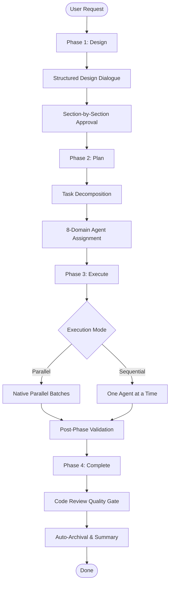

# 🧵 Loom

[](https://github.com/Nickalus12/loom-orchestrate/releases)
[](LICENSE)
[](https://github.com/google-gemini/gemini-cli)
[](https://docs.anthropic.com/en/docs/claude-code)
[](https://github.com/BerriAI/litellm)

**Loom** is a high-performance multi-agent orchestration framework designed for complex engineering tasks. It coordinates a team of 22 specialized agents through a structured, 4-phase workflow, delivering production-grade code with built-in quality gates.

Built for **Gemini CLI** and **Claude Code**, Loom features native **Model Agnostic Azure Support** and **Virtual Model Tiering**, allowing you to route tasks to the most cost-effective models without changing your code.

---

## 🚀 Why Loom?

In a world of generalist AI, Loom brings **specialization**. Instead of one model trying to do everything, Loom delegates to experts:
- **Efficiency**: Parallel execution of independent tasks reduces wall-clock time.
- **Quality**: Built-in code review, security audits, and validation gates ensure robust output.
- **Cost Control**: Virtual Model Tiering routes heavy reasoning to powerful models and utility tasks to lightweight ones.
- **Persistence**: Full session state management allows you to resume complex orchestrations across interruptions.

---

## ✨ Key Features

- **22 Specialized Agents**: From `architect` and `coder` to `security_engineer` and `seo_specialist`.
- **4-Phase Standard Workflow**: Structured Design, Planning, Execution, and Completion phases.
- **Express Workflow**: Streamlined 1-phase flow for simple, single-concern tasks.
- **Model Agnostic Azure Support**: Native integration with any Azure AI Foundry deployment via LiteLLM.
- **Virtual Model Tiering**: Optimized routing using `HEAVY` (reasoning/coding) and `LIGHT` (utility/docs) tiers.
- **Native Parallel Execution**: Concurrent dispatch of independent phases using the runtime's native scheduler.
- **Standalone Tools**: Direct access to `/review`, `/debug`, `/security-audit`, and more.

---

## 🛠️ How It Works

### The Standard Workflow
For medium and complex tasks, Loom follows a rigorous 4-phase process:



### Express Workflow
For simple tasks, Loom detects low complexity and skips the ceremony, moving straight from a brief to implementation and review.

---

## 🤖 The Agent Roster

Loom coordinates 22 specialists across 8 domains. Agents are tiered by their reasoning requirements:

| Tier | Focus | Agents |
| :--- | :--- | :--- |
| **HEAVY** | Reasoning & Coding | `architect`, `coder`, `debugger`, `refactor`, `security_engineer`, `api_designer` |
| **LIGHT** | Utility & Audits | `code_reviewer`, `tester`, `technical_writer`, `devops_engineer`, `performance_engineer`, `data_engineer`, `ux_designer`, `product_manager`, `seo_specialist`, `accessibility_specialist`, `compliance_reviewer`, `i18n_specialist`, `analytics_engineer`, `copywriter`, `content_strategist`, `design_system_engineer` |

---

## 🌐 Model Agnostic Azure Support

Loom is provider-agnostic. It uses a **LiteLLM Proxy** to communicate with any model, including private Azure AI Foundry deployments.

### 1. Setup LiteLLM Proxy
Run a LiteLLM proxy that maps your models to Loom's virtual tiers:

```bash
# Example litellm config.yaml
model_list:
  - model_name: loom-heavy
    litellm_params:
      model: azure/gpt-4o
      api_key: "os.environ/AZURE_API_KEY"
      api_base: "os.environ/AZURE_API_BASE"
  - model_name: loom-light
    litellm_params:
      model: azure/gpt-35-turbo
      api_key: "os.environ/AZURE_API_KEY"
      api_base: "os.environ/AZURE_API_BASE"
```

### 2. Configure Loom
Loom defaults to `loom-heavy` and `loom-light` aliases. You can override these via environment variables:

| Variable | Default | Usage |
| :--- | :--- | :--- |
| `LOOM_HEAVY_MODEL` | `loom-heavy` | The model used for HEAVY tier agents |
| `LOOM_LIGHT_MODEL` | `loom-light` | The model used for LIGHT tier agents |

---

## 🏁 Quick Start

### 1. Prerequisites
Loom requires **Node.js 18+** and the experimental subagent system enabled in your Gemini CLI settings.

**~/.gemini/settings.json**:
```json
{
  "experimental": {
    "enableAgents": true
  }
}
```

### 2. Installation

**Gemini CLI**:
```bash
gemini extensions install https://github.com/Nickalus12/loom-orchestrate
```

**Claude Code**:
```bash
git clone https://github.com/Nickalus12/loom-orchestrate
claude --plugin-dir /path/to/loom-orchestrate/claude
```

### 3. Start Orchestrating
Describe your task and let Loom take the lead:

```bash
# Gemini CLI
/loom:orchestrate Build a secure authentication system with JWT and MFA

# Claude Code
/orchestrate Build a secure authentication system with JWT and MFA
```

---

## ⌨️ Command Reference

| Command | Gemini CLI | Claude Code | Purpose |
| :--- | :--- | :--- | :--- |
| **Orchestrate** | `/loom:orchestrate` | `/orchestrate` | Start full 4-phase workflow |
| **Execute** | `/loom:execute` | `/execute` | Run an approved plan |
| **Resume** | `/loom:resume` | `/resume` | Resume an interrupted session |
| **Status** | `/loom:status` | `/status` | View current session progress |
| **Review** | `/loom:review` | `/review` | Standalone code review |
| **Debug** | `/loom:debug` | `/debug` | Systematic root cause analysis |
| **Security** | `/loom:security-audit` | `/security-audit` | OWASP-aligned security audit |

---

## 🏗️ Architecture

Loom is built on a modular 9-layer architecture, ensuring separation of concerns between the orchestrator, specialized agents, and methodology skills.

- **Orchestrator**: The TechLead persona (`GEMINI.md`) managing the workflow.
- **Agents**: 22 specialist definitions with least-privilege tool access.
- **Skills**: Reusable methodologies (Design, Planning, Validation).
- **Hooks**: Lifecycle middleware for context injection and handoff validation.

For a deep dive, see [ARCHITECTURE.md](ARCHITECTURE.md).

---

## ⚙️ Configuration

| Variable | Default | Description |
| :--- | :--- | :--- |
| `LOOM_STATE_DIR` | `docs/loom` | Root for session state and plans |
| `LOOM_MAX_RETRIES` | `2` | Retry limit per phase |
| `LOOM_VALIDATION_STRICTNESS` | `normal` | `strict`, `normal`, or `lenient` |
| `LOOM_EXECUTION_MODE` | `ask` | `parallel`, `sequential`, or `ask` |

---

## 📄 License

Apache-2.0
